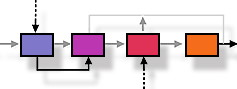

<table width="100%" border="0" cellspacing="0" cellpadding="0">
<tr>
<th><h2>Welcome to the JSR 355 (EC Merge) project</h2></th>
<th> </th>
</tr>
</table>

This is the public project for  [JSR 355: JCP Executive Committee Merge](http://jcp.org/en/jsr/detail?id=355), 
the second of three JSRs to modify the JCP's processes. 

This JSR will make changes to the JCP's Process Document and the Executive Committee's Standing Rules with the goal of merging the two Executive Committees into one and reducing the number of Executive Committee members from the current total of 32. 

As required by the first jcp.next JSR - JSR 348 - the Expert Group has committed to running this JSR in the most transparent manner. We will therefore discuss our business in public, publish all of our working materials and meeting minutes, and track issues in the open:

* To join the Observers' alias (to review and perhaps respond to Expert Group communications), write to the Maintenance Lead.
* Visit the <a href="http://java.net/projects/jsr355/forums/General">discussion forum</a> to comment on the work of the Expert Group (we'd prefer that you use this rather than the Observer alias, to keep mail traffic down.)
* For our meeting minutes and working documents, visit the <a href="https://github.com/jcp-org/jsr355/wiki/DocumentIndex">document archive</a>.
* We use the <a href="https://github.com/jcp-org/jsr355/issues">issue tracker</a> to record your comments and track issues.
